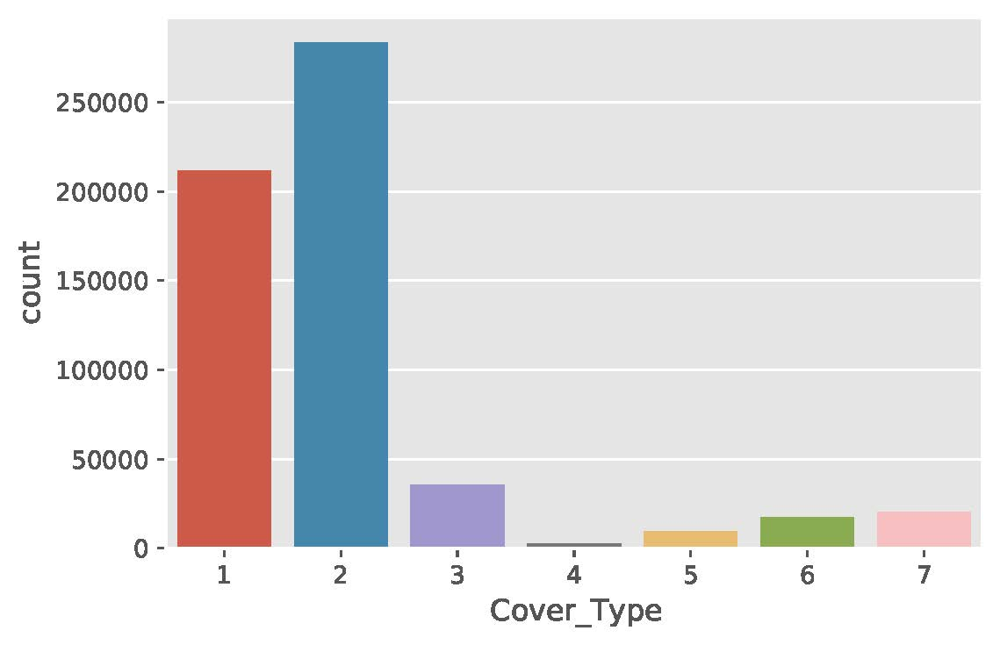

# Just a simple Random Forest Classifier for Covertype Data Set
---
Note: For last couple of days, I was not doing some coding (I was occupied with applying to a Ph.D. program), and it made me feel sad a bit, that's why I decided to do this small project suddenly. As a result, it is not a polished project and has a lot of room for improvements, more analysis and proper evaluations. Which hopefully, I will get back to it soon! :)

---
```
Accuracy on test data: 0.9509
```

Observation:
---
The class labels are not at all balanced, hopefully, in the future, I will look into it more and balance the dataset. The issue is, due to the presence of instances belonging to classes 1 and 2 are higher than other instances, the model is biased towards this class label. Therefore, this issue needs to be addressed.




Dataset: 
---
https://archive.ics.uci.edu/ml/datasets/covertype


## TODO
* [ ] Provide proper documentaiton
* [ ] Dataset characteristics
* [ ] Address class imbalance issue


